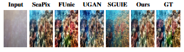

# ClearVision: Seeing Through Turbidity

**A Physics-Informed Lightweight CNN for Real-Time Enhancement of Sediment-Degraded Underwater Imagery**

---

## Overview
**ClearVision** is a lightweight, real-time enhancement framework designed specifically for highly turbid underwater environments (estuaries, deep-sea mining zones, and ports). Unlike standard models that focus on color correction in clear water, ClearVision targets extreme sediment scattering.


### Key Features
* **Real-Time:** Runs at 50 FPS (on T4 GPU).
* **Physics-Informed:** Incorporates depth-weighted attenuation and CIELAB color constraints.
* **Robotic Utility:** Increases valid ORB feature matches by 16x (from 1.88 to 32.77), enabling VSLAM in blind conditions.

---

## Setup & Installation

### Clone Repository
```bash
git clone https://github.com/dishantroland2025/ClearVision-Turbidity-Resilient-GAN.git
cd ClearVision

```

Install Dependencies
You can automatically install all required packages via: `pip install -r requirements.txt`
Dataset
We utilize a rectified composite dataset derived from the Turbid-UIEB and Turbid-LSUI benchmarks. 

**Note:** Dataset paths are provided as command-line arguments during training. o specific folder structure is required.

### Recommended Directory Structure (Optional)

```
ClearVision/
├── dataset/
│   ├── train/
│   └── test/
│       ├── raw/       # Input turbid images
│       ├── reference/ # Ground truth
│       └── enhanced/  # (Generated by model)

```

## Training

### Phase 1: Initial Training (200 epochs)

Train the model from scratch using physics-informed loss functions:
```bash
python train_ClearVision.py \
  --name "ClearVision_Phase1" \
  --turbid_path "/path/to/dataset/train/Raw" \
  --clear_path "/path/to/dataset/train/GT" \
  --depth_path "/path/to/dataset/train/depths" \
  --checkpoint_dir "checkpoints/" \
  --sample_dir "samples/" \
  --epochs 200 \
  --batch_size 16 \
  --lr 0.0002 \
  --lambda_pixel 50.0 \
  --lambda_adv 0.5 \
  --lambda_ssim 0.0 \
  --lambda_color 1.0 \
  --lambda_edge 0.5 \
  --lambda_perc 1.0 \
  --lambda_depth 0.5 \
  --ngf 48 \
  --ndf 128 \
  --use_amp
```

**Key Parameters:**
- `--name`: Experiment identifier
- `--epochs`: Training iterations (default: 200)
- `--batch_size`: Batch size (adjust based on GPU memory)
- `--use_amp`: Enable automatic mixed precision for faster training

---

### Phase 2: Fine-tuning (50 epochs)

Refine the pre-trained model with adjusted hyperparameters:
```bash
python train_ClearVision.py \
  --name "ClearVision_Phase2_Final" \
  --finetune "checkpoints/ClearVision_Phase1/epoch_200.pth" \
  --turbid_path "/path/to/dataset/train/Raw" \
  --clear_path "/path/to/dataset/train/GT" \
  --depth_path "/path/to/dataset/train/depths" \
  --checkpoint_dir "checkpoints/" \
  --sample_dir "samples/" \
  --epochs 50 \
  --batch_size 16 \
  --lr 0.00001 \
  --lambda_pixel 100.0 \
  --lambda_ssim 0.0 \
  --lambda_adv 0.1 \
  --lambda_color 1.0 \
  --lambda_edge 0.5 \
  --lambda_perc 1.0 \
  --lambda_depth 0.5 \
  --ngf 48 \
  --ndf 128 \
  --use_amp
```

**Phase 2 Changes:**
- Reduced learning rate (0.00001 vs 0.0002)
- Increased pixel loss weight (100.0 vs 50.0)
- Reduced adversarial loss (0.1 vs 0.5)

---

## Inference (Testing)

### Using Pre-trained Weights

1. **Download Pre-trained Model:**
   - [ClearVision Weights](https://drive.google.com/your-link) → Save to `checkpoints/`

2. **Run Inference:**
```bash
python test.py \
  --turbid_path "/path/to/dataset/test/Raw" \
  --results_dir "./results" \
  --checkpoint_path "checkpoints/ClearVision_Phase2_Final/latest.pth" \
  --ngf 48
```

**Parameters:**
- `--turbid_path`: Directory containing test turbid images
- `--results_dir`: Output directory for enhanced images
- `--checkpoint_path`: Path to trained model weights
- `--ngf`: Generator filter count (must match training)

**Output:** Enhanced images saved to `./results/`

---

## Loss Function Weights Guide

| Loss Component | Phase 1 | Phase 2 | Purpose |
|----------------|---------|---------|---------|
| `lambda_pixel` | 50.0 | 100.0 | Pixel-level L1 reconstruction |
| `lambda_adv` | 0.5 | 0.1 | Adversarial realism |
| `lambda_ssim` | 0.0 | 0.0 | Structural similarity |
| `lambda_color` | 1.0 | 1.0 | CIELAB color fidelity |
| `lambda_edge` | 0.5 | 0.5 | Sobel edge preservation |
| `lambda_perc` | 1.0 | 1.0 | VGG perceptual loss |
| `lambda_depth` | 0.5 | 0.5 | Depth-weighted attenuation |


### Table: Performance comparison on Turbid-imagery dataset.
*FPS was measured on the T4 GPU*

| Model | PSNR (↑) | SSIM (↑) | UIQM (↑) | Param (M) (↓) | FPS (↑) |
| :--- | :---: | :---: | :---: | :---: | :---: |
| Sea-Pix GAN | 17.431 | **0.721** | 3.070 | 54.0 | 139.5 |
| FUnIE-GAN | 16.090 | 0.558 | 2.964 | **7.0** | **145.0** |
| U-GAN | 13.435 | 0.401 | 3.124 | 54.4 | 138.0 |
| SGUIE-Net | 17.301 | 0.683 | 3.169 | 17.0 | 16.4 |
| ClearVision (Ours) | **18.612** | 0.706 | **3.171** | 9.1 | 49.8 |

## Visual Comparison

<p align="center">
  
</p>

<p align="center">
  <em>
Fig : Qualitative comparison on the Turbid-imagery dataset
across different underwater image enhancement models.
  </em>
</p>

---


